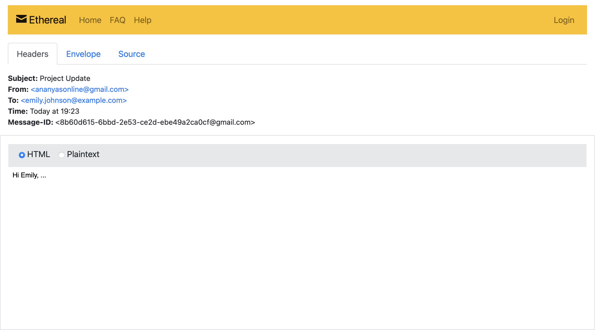
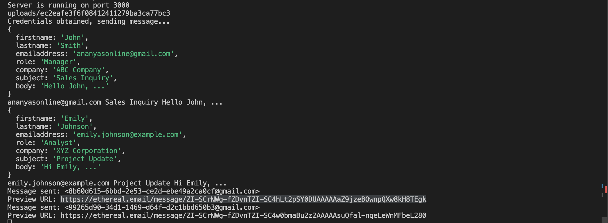

# Frontend
Install the dependencies using
``` npm install ```
Run the application in the frontend directory using 
```npm start   ```

# Backend
Install the dependencies using
``` npm install ```
Run the application in the backend directory using 
```npm start   ```

# Process
On uploading a csv file – the backend parses the file using csv-parser.
If the file format is appropriate, the emails are sent out according to the csv using the nodemailer package. 

# Previous Attempts
1. Initially attempted to use Zapier, since the GSheets and GMail integration was smooth and worked well. However, integrating it to the frontend posed a few issues. 
    - The new spreadsheet event was not getting triggered appropirately.
    - The new file in Google Drive folder event was cumbersome. It involved using an intermediate event to be able to access the excel sheet data.
    - Zapier webhook seems to be a premium feature and also integrating with Gmail requires Gdrive authentication which was tedious to set up.

2. Decided against Zapier and looked for node packages instead, Nodemailer seemed appropriate. Integrating Gmail with nodemailer still required OAuth access tokens. Almost gave in to that method, but then I stumbled upon test accounts in nodemailer. 
https://ethereal.email is a fake SMTP service which was ther perfect usecase for this project. 


# Output
Following is an image from the fake SMTP service to view the email


Following are the logs from the backend server

